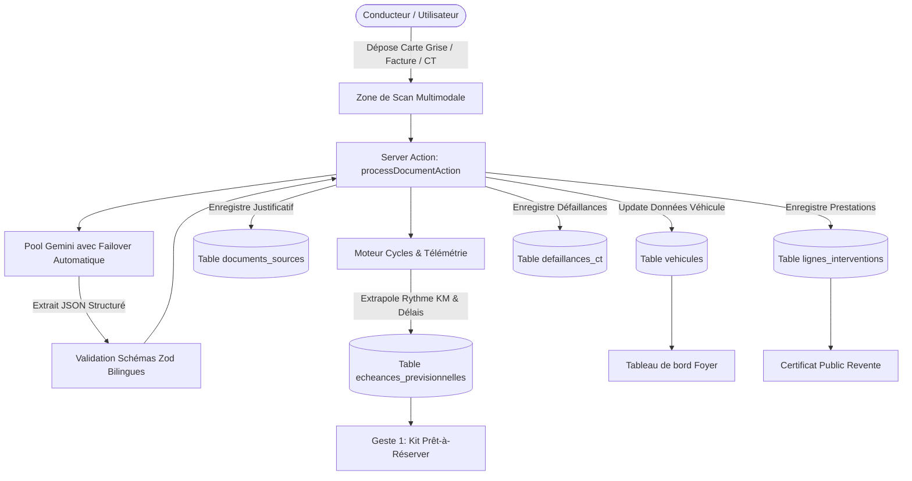
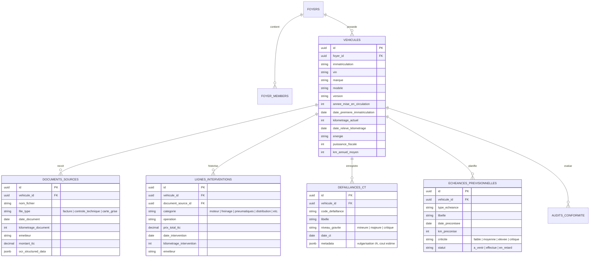

# 🏗️ Architecture Technique — LaVigieAuto

Ce document détaille les choix d'architecture, le modèle de données relationnel, le pipeline d'ingestion multimodale par IA et les algorithmes de projection prédictive de LaVigieAuto.

---

## 1. Vue d'Ensemble des Flux

---

## 2. Modèle de Données Supabase (PostgreSQL)

Le modèle relationnel est structuré autour du concept de **Foyer multi-véhicules** :

---

## 3. Pipeline d'Ingestion & Résilience IA Multi-Modèles

### A. Tolérance Bilingue & Normalisation des Données
Le système accepte nativement les formats hétérogènes générés par les logiciels de garages français et les codes d'immatriculation :
* **Cartes Grises françaises SIV/FNI** : Clés officielles reconnues (`A`, `B`, `D.1`, `D.2`, `D.3`, `E`, `P.3`, `P.6`, `K`, `V.7`) et mappées sur `licensePlate`, `vin`, `firstRegistrationDate`, etc.
* **Factures d'ateliers** : Support des variantes `prestations[]`, `operations[]`, `lignes_facture[]` et `lineItems[]`.
* **PV de Contrôle Technique** : Support des listes `defects[]` et des sous-groupes `defaillances.mineures / majeures / critiques`.

### B. Failover Automatique (Anti-Quota 429)
Pour éviter tout blocage lié aux quotas de l'API Google Gemini, `GeminiLLMProvider` utilise un pool ordonné de modèles réactifs :
1. `gemini-3.5-flash` (Principal haute performance)
2. `gemini-flash-latest` (Fallback 1)
3. `gemini-3.5-flash-lite` (Fallback 2 léger)
4. `gemini-3.7-flash` (Fallback 3)

Si un modèle renvoie une erreur `HTTP 429` (Quota dépassé), `HTTP 404` ou un timeout, le fournisseur bascule automatiquement et de manière transparente sur le modèle suivant.

---

## 4. Algorithmes Prédictifs

### A. Calcul Dynamique du Rythme Kilométrique (`cycles.ts`)
* **Multi-Factures (2+ relevés)** : Calcul exact du delta de kilomètres divisé par le delta de jours entre chaque passage en atelier certifié.
* **Mono-Relevé (1 document ou CT)** : Extrapolation précise calculée depuis la date de 1ère mise en circulation du véhicule (`date_premiere_immatriculation`) jusqu'à la date du relevé.
* **Projection à date** : Calcul en temps réel du kilométrage estimé du jour :  
  $$\text{Kilométrage Estimé} = \text{Dernier Relevé} + (\text{Jours écoulés} \times \text{Rythme journalier})$$

### B. Planification au 1er Terme Échu
Chaque échéance constructeur est projetée sur un axe bidirectionnel (Kilomètres vs Temps) :
* L'échéance se déclenche dès que le premier des deux seuils est atteint ($\min(\text{Date cible par km}, \text{Date cible par temps})$).

---

## 5. Coffre-fort Documentaire (`vehicle-vault`)

Le stockage physique des justificatifs numérisés (factures, contrôles techniques, cartes grises) est entièrement découplé et sécurisé :

### A. Configuration Centralisée (`config/storage.config.ts`)
* **Bucket Privé** : `vehicle-vault` (taille max : 15 Mo, formats : PDF, JPEG, PNG, WEBP, HEIC).
* **Nomenclature Déterministe** :
  $$\{user\_id\}/\{vehicle\_id\}/\{folder\}/\{date\}\_\{immat\}\_\{type\}\_\{km\}km\_\{entity\}.\{ext\}$$
  *Exemple :* `user-123/veh-456/invoices/2026-08-21_EC-301-JX_invoice_125789km_garage-heliere.pdf`

### B. Sécurité & Politiques RLS (Row-Level Security)
* Les utilisateurs accèdent exclusivement à leur propre dossier utilisateur (`storage.foldername(name)[1] = auth.uid()`).
* La prévisualisation et le téléchargement s'effectuent via **URLs signées temporaires** (durée : 1 heure) générées à la demande sans jamais exposer le bucket en accès public.
* Les acheteurs potentiels peuvent consulter les justificatifs scellés directement depuis le Passeport / Certificat Public de Revente (`/v/[public_token]`).

---

## 6. Cloisonnement Strict Inter-Véhicules & Auto-Guérison (Vehicle Isolation)

Afin de garantir l'étanchéité absolue entre les véhicules d'un même foyer (ex: Suzuki Vitara et Renault Espace V) :

### A. Routage Déterministe à l'Ingestion (`documents.ts`)
1. **Priorité absolue à la vérité de la plaque** : Si un document extrait une plaque formelle différente de la page active, il est immédiatement réorienté vers le véhicule correspondant sans altérer le véhicule en cours de consultation.
2. **Interdiction de l'amalgamation aveugle** : Si aucune plaque n'est lue, le document ne peut être associé au véhicule unique du foyer que si la marque et le modèle concordent fidèlement. En cas de marque différente, un nouveau véhicule dédié est instantanément créé.

### B. Auto-Guérison Odométrique (`vehicles.ts` / `foyer.ts`)
* L'odomètre affiché et utilisé pour les calculs prédictifs est **dynamiquement validé par rapport au maximum réel des pièces justificatives de ce véhicule précis** :
  $$\text{Odomètre Effectif} = \max(0, \max(\text{km documents}), \max(\text{km interventions}))$$
* Tout bond kilométrique anormal provenant d'un ancien document croisé est neutralisé en temps réel.

---

## 7. Moteurs Prédictifs de Sécurité (Pneumatiques & Freinage)

### A. Moteur Prédictif du Freinage (`src/lib/engine/brakes.ts`)
* **Modélisation physique par essieu (AV/AR)** :
  * Garniture neuve : `12.0 mm` (Avant) / `10.0 mm` (Arrière).
  * Seuil d'alerte prévention : `4.0 mm` (~75-80% d'usure).
  * Témoin d'usure critique légale : `2.0 mm` (Remplacement immédiat obligatoire).
* **Extraction des mesures atelier** : Détection regex des relevés de diagnostic atelier (ex: `CTRL PLAQUETTES AV 80% D'USURE`) et des codes défaillances CT (`1.1.13.a.1` / `1.1.14.a.1`).
* **Règle 2-pour-1 des Disques** : Recommandation de remplacement combiné disques + plaquettes dès que l'usure plaquettes dépasse 80% pour économiser un forfait de main-d'œuvre.
* **Kit Devis Freins** : Estimation budgétaire TTC posé et script téléphonique prêt-à-dire pour le garagiste.

### B. Moteur Prédictif des Pneumatiques (`src/lib/engine/tires.ts`)
* **Profondeur de sculpture** : Neuf (`8.0 mm`) $\rightarrow$ Alerte (`3.0 mm`) $\rightarrow$ Témoin légal (`1.6 mm`).
* **Suivi par train roulant** : Calcul d'usure différencié selon motricité (Traction 2WD, Propulsion, Transmission Intégrale 4WD/AllGrip).
* **Comparateur & Agrégateur de Devis** : Recherche en temps réel de montes homologuées avec coût de pose et équilibrage.

---

## 8. Catalogue Véhicules & Zéro Fake Data (`vehicle-catalog.ts`)

* **Catalogue pur & découplé** : Centralisation complète de la résolution des motorisations, puissances DIN/kW/fiscales, transmissions (BVA EDC/EAT/DSG vs BVM), et types de distribution (chaîne vs courroie).
* **Règle Zéro Fake Data** : Aucune donnée simulée, mock ou graine artificielle de secours dans l'application de production. Les états vides affichent une invitation authentique à téléverser un document.

