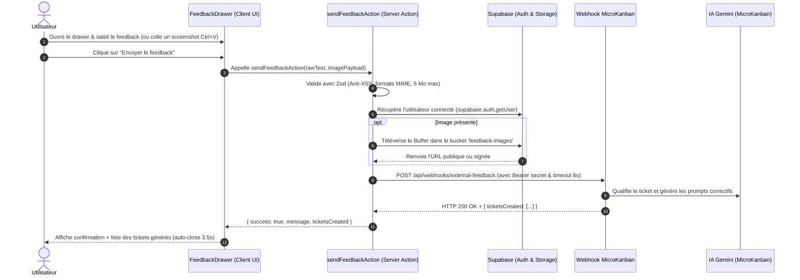

# 📘 Guide d'Intégration : Système de Feedback Utilisateur & Webhook MicroKanban

Ce guide technique détaille la mise en œuvre pas-à-pas du système de feedback utilisateur avec routage automatique vers **MicroKanban**, prêt à être réutilisé dans tout projet partageant la stack :
- **Framework** : Next.js 14/15 (App Router, Server Actions `"use server"`)
- **Hébergement** : Vercel
- **Base de données & Auth & Storage** : Supabase
- **Styling & UI** : Tailwind CSS, Lucide React
- **Validation** : Zod

---

## 🗺️ 1. Architecture & Flux de Données



---

## 🔑 2. Variables d'Environnement & Configuration Supabase

### A. Variables d'environnement (`.env.local` et Vercel)
Ajoutez ces variables à votre fichier `.env.local` et sur votre projet Vercel (*Settings > Environment Variables*) :

```env
# Clé d'API secrète partagée avec MicroKanban
MICROKANBAN_API_SECRET=votre_cle_secrete_partagee

# URL du webhook MicroKanban (valeur par défaut si non spécifiée)
MICROKANBAN_API_URL=https://jira-like.vercel.app/api/webhooks/external-feedback

# Configuration Supabase standard
NEXT_PUBLIC_SUPABASE_URL=https://votre-projet.supabase.co
NEXT_PUBLIC_SUPABASE_ANON_KEY=eyJhbGciOi...
SUPABASE_SERVICE_ROLE_KEY=eyJhbGciOi...
```

### B. Configuration Supabase Storage
1. Accédez à votre tableau de bord Supabase : **Storage** > **New Bucket**.
2. Créez un bucket nommé : `feedback-images`.
3. Cochez **Public Bucket** (recommandé pour que MicroKanban puisse lire l'image via son URL publique sans expiration de token).
4. *Politiques RLS (Optionnel)* : Si vous utilisez `createAdminClient` (avec `SUPABASE_SERVICE_ROLE_KEY`) côté serveur, les opérations d'écriture bypassent le RLS en toute sécurité.

---

## 🛡️ 3. Étape 1 : Schéma Zod et Sécurité Anti-XSS

Créez le fichier `src/lib/feedback/schema.ts` :

```typescript
// src/lib/feedback/schema.ts
import { z } from "zod";

const ALLOWED_IMAGE_MIMES = [
  "image/png",
  "image/jpeg",
  "image/jpg",
  "image/webp",
  "image/gif",
];

const MAX_IMAGE_SIZE_BYTES = 5 * 1024 * 1024; // 5 Mo

export const feedbackFormSchema = z.object({
  text: z
    .string()
    .min(3, "Le message doit contenir au moins 3 caractères.")
    .max(5000, "Le message ne peut pas dépasser 5000 caractères.")
    .trim(),
  image: z
    .object({
      base64Data: z.string().refine((data) => {
        if (!data) return true;
        // Validation stricte du format Data URI
        const match = data.match(/^data:([^;]+);base64,(.+)$/);
        if (!match) return false;
        const mime = match[1].toLowerCase();
        // Blocage strict Anti-XSS : interdiction du SVG/XML
        if (mime.includes("svg") || mime.includes("xml")) return false;
        return ALLOWED_IMAGE_MIMES.includes(mime);
      }, "Format d'image non supporté (seuls PNG, JPEG, WEBP et GIF sont acceptés)."),
      fileName: z.string().max(255).default("capture.png"),
    })
    .optional()
    .refine((img) => {
      if (!img?.base64Data) return true;
      try {
        const match = img.base64Data.match(/^data:[^;]+;base64,(.+)$/);
        if (!match) return true;
        const binaryLength = (match[1].length * 3) / 4;
        return binaryLength <= MAX_IMAGE_SIZE_BYTES;
      } catch {
        return false;
      }
    }, "L'image ne doit pas dépasser 5 Mo."),
});

export type FeedbackFormInput = z.infer<typeof feedbackFormSchema>;

export interface FeedbackResult {
  success: boolean;
  message?: string;
  error?: string;
  ticketsCreated?: Array<{ id: string; title: string; type: string }>;
}
```

---

## ⚡ 4. Étape 2 : Server Action Next.js

Créez le fichier `src/app/actions/feedback.ts` :

> ⚠️ **Règle Next.js App Router** : Dans un fichier `"use server"`, **seules des fonctions `async`** peuvent être exportées. Les types ou schémas doivent résider dans `src/lib/feedback/schema.ts`.

```typescript
// src/app/actions/feedback.ts
"use server";

import { createClient, createAdminClient } from "@/lib/supabase/server";
import { feedbackFormSchema, type FeedbackResult } from "@/lib/feedback/schema";

export async function sendFeedbackAction(
  rawText: string,
  imagePayload?: { base64Data: string; fileName: string }
): Promise<FeedbackResult> {
  // 1. Validation des entrées avec Zod
  const parsed = feedbackFormSchema.safeParse({
    text: rawText,
    image: imagePayload?.base64Data ? imagePayload : undefined,
  });

  if (!parsed.success) {
    return {
      success: false,
      error: parsed.error.issues[0]?.message || "Données de feedback invalides.",
    };
  }

  const { text, image } = parsed.data;

  // 2. Contexte utilisateur authentifié (Supabase Auth)
  let userEmail = "Utilisateur non connecté";
  let userId: string | null = null;
  try {
    const supabase = await createClient();
    const {
      data: { user },
    } = await supabase.auth.getUser();
    if (user) {
      userEmail = user.email || "Utilisateur sans email";
      userId = user.id;
    }
  } catch (err) {
    console.warn("[FEEDBACK] Impossible de récupérer l'utilisateur connecté :", err);
  }

  // 3. Traitement et téléversement de l'image (si fournie)
  let imageUrl: string | undefined = undefined;

  if (image?.base64Data) {
    try {
      const match = image.base64Data.match(/^data:([^;]+);base64,(.+)$/);
      if (match) {
        const mimeType = match[1].toLowerCase();
        const base64Data = match[2];
        const buffer = Buffer.from(base64Data, "base64");
        const ext = mimeType.split("/")[1] || "png";
        const filename = `feedback_${Date.now()}_${Math.random().toString(36).substring(2, 7)}.${ext}`;

        const adminSupabase = createAdminClient();
        const { error: uploadError } = await adminSupabase.storage
          .from("feedback-images")
          .upload(filename, buffer, {
            contentType: mimeType,
            upsert: true,
          });

        if (!uploadError) {
          const { data: publicUrlData } = adminSupabase.storage
            .from("feedback-images")
            .getPublicUrl(filename);
          imageUrl = publicUrlData?.publicUrl;
        } else {
          console.warn("[FEEDBACK] Storage upload warning (fallback base64) :", uploadError.message);
          imageUrl = image.base64Data;
        }
      }
    } catch (storageErr) {
      console.warn("[FEEDBACK] Erreur téléversement Supabase Storage :", storageErr);
      imageUrl = image.base64Data;
    }
  }

  // 4. Enrichissement du contexte pour l'IA MicroKanban
  // ADAPTEZ ICI LE NOM DE VOTRE APPLICATION :
  const APP_NAME = "MonProjet"; // Ex: LaVigieAuto, CRM Smart Sync, etc.
  const GITHUB_REPO = "MonOrga/mon-repo"; // Ex: GenoaAI/lavigieauto

  const enrichedText = `[Émis par : ${userEmail}${userId ? ` (ID: ${userId})` : ""}]
Application : ${APP_NAME}

${text}`;

  // 5. Appel sécurisé du webhook MicroKanban
  const webhookUrl =
    process.env.MICROKANBAN_API_URL ||
    "https://jira-like.vercel.app/api/webhooks/external-feedback";
  const apiSecret =
    process.env.MICROKANBAN_API_SECRET ||
    process.env.EXTERNAL_API_SECRET;

  if (!apiSecret) {
    console.error("[FEEDBACK] MICROKANBAN_API_SECRET non configuré.");
    return {
      success: false,
      error: "Configuration serveur incomplète : clé d'API MicroKanban manquante.",
    };
  }

  const payload = {
    text: enrichedText,
    sourceApp: APP_NAME,
    githubRepo: GITHUB_REPO,
    imageUrl,
  };

  try {
    const authHeader = apiSecret.startsWith("Bearer ")
      ? apiSecret
      : `Bearer ${apiSecret}`;
    const rawSecret = apiSecret.replace(/^Bearer\s+/i, "").trim();

    // Timeout de 6s pour éviter tout blocage Serverless Vercel
    const controller = new AbortController();
    const timeoutId = setTimeout(() => controller.abort(), 6000);

    const response = await fetch(webhookUrl, {
      method: "POST",
      headers: {
        "Content-Type": "application/json",
        Authorization: authHeader,
        "x-api-secret": rawSecret,
      },
      body: JSON.stringify(payload),
      signal: controller.signal,
    }).finally(() => {
      clearTimeout(timeoutId);
    });

    if (!response.ok) {
      const errorText = await response.text();
      console.error(`[FEEDBACK] Échec webhook MicroKanban (${response.status}) :`, errorText);
      return {
        success: false,
        error: `Erreur lors de la transmission à MicroKanban (HTTP ${response.status}).`,
      };
    }

    const data = await response.json();
    return {
      success: true,
      message: "Merci ! Votre feedback a bien été envoyé et transmis à MicroKanban.",
      ticketsCreated: data.ticketsCreated || [],
    };
  } catch (err) {
    if (err instanceof Error && err.name === "AbortError") {
      console.warn("[FEEDBACK] Timeout atteint (6s) lors de l'appel MicroKanban.");
      return {
        success: true,
        message: "Votre feedback a été transmis et sera traité en arrière-plan.",
      };
    }
    console.error("[FEEDBACK] Erreur réseau :", err);
    return {
      success: false,
      error: err instanceof Error ? err.message : "Erreur réseau lors de l'envoi du feedback.",
    };
  }
}
```

---

## 🎨 5. Étape 3 : Composant Client (`FeedbackDrawer.tsx`)

Créez le fichier `src/components/feedback/FeedbackDrawer.tsx` :

Fonctionnalités incluses :
- **Bouton Flottant (FAB)** avec gradient moderne et prise en compte du `safe-area-inset-bottom` (iOS).
- **Volet coulissant (Drawer)** fluide avec flou d'arrière-plan.
- **Capture automatique depuis le presse-papier (`Ctrl+V` / `Cmd+V`)**.
- **Glisser-déposer (Drag & Drop)** ou sélection directe de fichier.
- **Retour instantané 0ms** avec `useTransition` et `Loader2`.
- **Affichage des tickets créés** renvoyés par MicroKanban.

```tsx
// src/components/feedback/FeedbackDrawer.tsx
"use client";

import { useState, useRef, useEffect, useTransition } from "react";
import {
  MessageSquare,
  X,
  UploadCloud,
  CheckCircle2,
  AlertCircle,
  Loader2,
  Sparkles,
} from "lucide-react";
import { sendFeedbackAction } from "@/app/actions/feedback";

export function FeedbackDrawer() {
  const [isOpen, setIsOpen] = useState(false);
  const [text, setText] = useState("");
  const [attachedImage, setAttachedImage] = useState<string | null>(null);
  const [fileName, setFileName] = useState("");
  const [isDragging, setIsDragging] = useState(false);
  const [isSubmitting, setIsSubmitting] = useState(false);
  const [isPending, startTransition] = useTransition();
  const [error, setError] = useState<string | null>(null);
  const [success, setSuccess] = useState<string | null>(null);
  const [createdTickets, setCreatedTickets] = useState<
    Array<{ id: string; title: string; type: string }>
  >([]);

  const fileInputRef = useRef<HTMLInputElement>(null);
  const drawerRef = useRef<HTMLDivElement>(null);

  // Fermeture par la touche Échap
  useEffect(() => {
    const handleKeyDown = (e: KeyboardEvent) => {
      if (e.key === "Escape") setIsOpen(false);
    };
    window.addEventListener("keydown", handleKeyDown);
    return () => window.removeEventListener("keydown", handleKeyDown);
  }, []);

  // Fermeture par clic extérieur
  useEffect(() => {
    const handleClickOutside = (e: MouseEvent) => {
      if (
        isOpen &&
        drawerRef.current &&
        !drawerRef.current.contains(e.target as Node) &&
        !(e.target as HTMLElement).closest(".feedback-trigger-btn")
      ) {
        setIsOpen(false);
      }
    };
    document.addEventListener("mousedown", handleClickOutside);
    return () => document.removeEventListener("mousedown", handleClickOutside);
  }, [isOpen]);

  const processFile = (file: File) => {
    if (!file.type.startsWith("image/")) {
      setError("Seules les images sont acceptées (PNG, JPEG, WEBP, GIF).");
      return;
    }
    if (file.type.includes("svg") || file.type.includes("xml")) {
      setError("Le format SVG n'est pas autorisé pour des raisons de sécurité.");
      return;
    }
    if (file.size > 5 * 1024 * 1024) {
      setError("L'image dépasse la taille maximale autorisée de 5 Mo.");
      return;
    }

    setError(null);
    const reader = new FileReader();
    reader.onloadend = () => {
      setAttachedImage(reader.result as string);
      setFileName(file.name || "capture.png");
    };
    reader.readAsDataURL(file);
  };

  // Support natif du copier-coller d'image (Ctrl+V)
  const handlePaste = (e: React.ClipboardEvent) => {
    const items = e.clipboardData.items;
    for (let i = 0; i < items.length; i++) {
      if (items[i].type.startsWith("image/")) {
        const file = items[i].getAsFile();
        if (file) {
          processFile(file);
          e.preventDefault();
          break;
        }
      }
    }
  };

  const handleDragOver = (e: React.DragEvent) => {
    e.preventDefault();
    setIsDragging(true);
  };

  const handleDragLeave = (e: React.DragEvent) => {
    e.preventDefault();
    setIsDragging(false);
  };

  const handleDrop = (e: React.DragEvent) => {
    e.preventDefault();
    setIsDragging(false);
    const files = e.dataTransfer.files;
    if (files && files.length > 0) {
      processFile(files[0]);
    }
  };

  const handleFileSelect = (e: React.ChangeEvent<HTMLInputElement>) => {
    const files = e.target.files;
    if (files && files.length > 0) {
      processFile(files[0]);
    }
  };

  const handleRemoveImage = () => {
    setAttachedImage(null);
    setFileName("");
    if (fileInputRef.current) {
      fileInputRef.current.value = "";
    }
  };

  const isBusy = isSubmitting || isPending;

  const handleSubmit = (e: React.FormEvent) => {
    e.preventDefault();
    if (!text.trim() || isBusy) return;

    setIsSubmitting(true);
    setError(null);
    setSuccess(null);
    setCreatedTickets([]);

    startTransition(async () => {
      try {
        const res = await sendFeedbackAction(
          text.trim(),
          attachedImage ? { base64Data: attachedImage, fileName } : undefined
        );

        if (res.success) {
          setSuccess(res.message || "Feedback transmis à MicroKanban !");
          if (res.ticketsCreated && res.ticketsCreated.length > 0) {
            setCreatedTickets(res.ticketsCreated);
          }
          setText("");
          handleRemoveImage();
          setTimeout(() => {
            setIsOpen(false);
            setSuccess(null);
            setCreatedTickets([]);
          }, 3500);
        } else {
          setError(res.error || "Une erreur est survenue.");
        }
      } catch (err) {
        setError(err instanceof Error ? err.message : "Erreur inattendue.");
      } finally {
        setIsSubmitting(false);
      }
    });
  };

  return (
    <>
      {/* Bouton Flottant (Floating Action Button) */}
      <button
        onClick={() => setIsOpen(!isOpen)}
        className="feedback-trigger-btn fixed bottom-[calc(5.5rem+env(safe-area-inset-bottom,0px))] md:bottom-6 right-4 sm:right-5 z-40 flex h-12 w-12 items-center justify-center rounded-full bg-gradient-to-tr from-blue-600 to-indigo-600 text-white shadow-xl shadow-blue-500/25 hover:from-blue-700 hover:to-indigo-700 hover:scale-105 active:scale-95 transition duration-200 border border-blue-400/30 touch-manipulation"
        title="Donner un avis / Signaler un bug"
        aria-label="Ouvrir le formulaire de feedback"
      >
        <MessageSquare className="w-5 h-5 text-white" />
      </button>

      {/* Voile d'arrière-plan (Backdrop) */}
      {isOpen && (
        <div
          className="fixed inset-0 z-50 bg-slate-900/40 backdrop-blur-xs transition-opacity duration-300"
          onClick={() => setIsOpen(false)}
        />
      )}

      {/* Volet coulissant (Drawer) */}
      <div
        ref={drawerRef}
        onPaste={handlePaste}
        className={`fixed top-0 right-0 z-50 h-full w-full sm:w-[440px] border-l border-slate-200 bg-white/95 backdrop-blur-md shadow-2xl transition-transform duration-300 ease-in-out flex flex-col ${
          isOpen ? "translate-x-0" : "translate-x-full"
        }`}
      >
        {/* Entête */}
        <div className="flex items-center justify-between border-b border-slate-200 px-6 py-4 bg-slate-50/80">
          <div className="flex items-center gap-2.5">
            <div className="w-8 h-8 rounded-lg bg-blue-100 text-blue-600 flex items-center justify-center">
              <Sparkles className="w-4 h-4" />
            </div>
            <div>
              <h2 className="text-sm font-bold text-slate-900">Donner un feedback</h2>
              <p className="text-xs text-slate-500">
                Remarque ou anomalie ? Vos retours améliorent l&apos;application.
              </p>
            </div>
          </div>
          <button
            onClick={() => setIsOpen(false)}
            className="rounded-lg p-1.5 text-slate-400 hover:bg-slate-200 hover:text-slate-700 transition"
            aria-label="Fermer"
          >
            <X className="w-5 h-5" />
          </button>
        </div>

        {/* Formulaire */}
        <form onSubmit={handleSubmit} className="flex-1 flex flex-col justify-between p-6 overflow-y-auto gap-4">
          <div className="space-y-4">
            {error && (
              <div className="rounded-xl border border-rose-200 bg-rose-50 p-3 text-xs text-rose-700 flex items-start gap-2">
                <AlertCircle className="w-4 h-4 flex-shrink-0 mt-0.5" />
                <span>{error}</span>
              </div>
            )}

            {success && (
              <div className="rounded-xl border border-emerald-200 bg-emerald-50 p-3.5 text-xs text-emerald-800 space-y-2">
                <div className="flex items-center gap-2 font-medium">
                  <CheckCircle2 className="w-4 h-4 text-emerald-600 flex-shrink-0" />
                  <span>{success}</span>
                </div>
                {createdTickets.length > 0 && (
                  <div className="pt-2 border-t border-emerald-200/60 space-y-1">
                    <p className="text-[11px] font-bold text-emerald-900">
                      🎟️ Tickets créés dans MicroKanban :
                    </p>
                    <ul className="list-disc list-inside text-[11px] text-emerald-700">
                      {createdTickets.map((t) => (
                        <li key={t.id}>
                          <span className="font-semibold">[{t.type}]</span> {t.title}
                        </li>
                      ))}
                    </ul>
                  </div>
                )}
              </div>
            )}

            {/* Saisie de texte */}
            <div className="space-y-1.5">
              <label className="text-xs font-semibold uppercase tracking-wider text-slate-700">
                Votre retour / Description
              </label>
              <textarea
                required
                disabled={isBusy}
                value={text}
                onChange={(e) => setText(e.target.value)}
                placeholder="Expliquez ce qui s'est passé, l'anomalie constatée ou l'amélioration souhaitée..."
                className="h-32 w-full rounded-xl border border-slate-200 bg-white p-3 text-xs text-slate-900 placeholder:text-slate-400 focus:border-blue-500 focus:ring-2 focus:ring-blue-500/20 outline-none transition disabled:bg-slate-50 disabled:text-slate-400"
              />
            </div>

            {/* Zone de téléversement et collage d'image */}
            <div className="space-y-1.5">
              <label className="text-xs font-semibold uppercase tracking-wider text-slate-700 flex items-center justify-between">
                <span>Capture d&apos;écran (optionnelle)</span>
                <span className="text-[10px] text-slate-400 font-normal">Max 5 Mo</span>
              </label>

              {!attachedImage ? (
                <div
                  onDragOver={handleDragOver}
                  onDragLeave={handleDragLeave}
                  onDrop={handleDrop}
                  onClick={() => fileInputRef.current?.click()}
                  className={`flex flex-col items-center justify-center rounded-xl border-2 border-dashed p-4 text-center cursor-pointer transition ${
                    isDragging
                      ? "border-blue-500 bg-blue-50/50"
                      : "border-slate-200 hover:border-slate-300 bg-slate-50/50"
                  }`}
                >
                  <UploadCloud className="w-7 h-7 text-slate-400 mb-1.5" />
                  <p className="text-xs text-slate-700 font-medium">
                    Glissez une image ou <span className="text-blue-600">parcourez</span>
                  </p>
                  <p className="text-[11px] text-slate-400 mt-1">
                    Astuce : collez directement avec <kbd className="px-1 py-0.5 bg-slate-200 rounded text-[10px] font-mono text-slate-700">Ctrl+V</kbd>
                  </p>
                  <input
                    type="file"
                    ref={fileInputRef}
                    onChange={handleFileSelect}
                    accept="image/png, image/jpeg, image/jpg, image/webp, image/gif"
                    className="hidden"
                  />
                </div>
              ) : (
                <div className="relative rounded-xl border border-slate-200 bg-slate-50 p-2.5 flex items-center gap-3">
                  <div className="relative h-12 w-12 rounded-lg border border-slate-200 overflow-hidden bg-slate-900 flex-shrink-0">
                    {/* eslint-disable-next-line @next/next/no-img-element */}
                    
                  </div>
                  <div className="min-w-0 flex-1">
                    <p className="text-xs font-medium text-slate-800 truncate">
                      {fileName || "Capture d'écran jointe"}
                    </p>
                    <button
                      type="button"
                      onClick={handleRemoveImage}
                      className="text-[11px] text-rose-600 hover:text-rose-700 font-semibold mt-0.5 block"
                    >
                      Supprimer la capture
                    </button>
                  </div>
                </div>
              )}
            </div>

            {/* Note informative */}
            <div className="rounded-lg bg-blue-50/60 p-2.5 border border-blue-100 text-[11px] text-slate-600">
              <span className="font-semibold text-blue-800">Auto-rédaction MicroKanban :</span> Votre retour est analysé par l&apos;IA pour générer automatiquement les tickets et les spécifications techniques.
            </div>
          </div>

          {/* Boutons d'action */}
          <div className="border-t border-slate-200 pt-4 flex gap-3">
            <button
              type="button"
              onClick={() => setIsOpen(false)}
              className="flex-1 rounded-xl border border-slate-200 bg-white hover:bg-slate-50 text-xs font-semibold text-slate-600 py-2.5 transition"
            >
              Annuler
            </button>
            <button
              type="submit"
              disabled={isBusy || !text.trim()}
              className="flex-1 rounded-xl bg-blue-600 hover:bg-blue-700 text-xs font-semibold text-white py-2.5 transition disabled:opacity-50 disabled:cursor-not-allowed shadow-md shadow-blue-500/20 flex items-center justify-center gap-2"
            >
              {isBusy ? (
                <>
                  <Loader2 className="w-4 h-4 animate-spin" />
                  <span>Envoi en cours...</span>
                </>
              ) : (
                <span>Envoyer le feedback</span>
              )}
            </button>
          </div>
        </form>
      </div>
    </>
  );
}
```

---

## 🌐 6. Étape 4 : Branchement dans le Layout Racine (`layout.tsx`)

Pour que le bouton flottant soit disponible partout dans votre application sans interférer avec les autres composants :

```tsx
// src/app/layout.tsx
import { FeedbackDrawer } from "@/components/feedback/FeedbackDrawer";

export default function RootLayout({
  children,
}: {
  children: React.ReactNode;
}) {
  return (
    <html lang="fr">
      <body className="antialiased min-h-screen">
        {children}
        {/* Intégration globale du volet de feedback */}
        <FeedbackDrawer />
      </body>
    </html>
  );
}
```

---

## 🧪 7. Étape 5 : Suite de Tests Automatisés (`tests/feedback.test.ts`)

Pour valider l'intégrité de votre implémentation sans dépendre du réseau extérieur :

```typescript
// tests/feedback.test.ts
import { feedbackFormSchema } from "../src/lib/feedback/schema";
import { sendFeedbackAction } from "../src/app/actions/feedback";

export async function testFeedbackIntegration() {
  console.log("▶ [TEST] Système de Feedback & Intégration Webhook MicroKanban...");

  // 1. Validation du Schéma Zod (Cas Valide)
  const validPayload = {
    text: "Le bouton de scan ne répond pas sur iPhone Safari.",
    image: {
      base64Data: "data:image/png;base64,iVBORw0KGgoAAAANSUhEUgAAAAEAAAABCAYAAAAfFcSJAAAADUlEQVR42mNk+M9QDwADhgGAWjR9awAAAABJRU5ErkJggg==",
      fileName: "screenshot.png",
    },
  };

  const parsedValid = feedbackFormSchema.safeParse(validPayload);
  if (!parsedValid.success) {
    throw new Error(`Échec de validation d'un payload valide : ${JSON.stringify(parsedValid.error.flatten())}`);
  }
  console.log("  ✔ Validation d'un payload avec image PNG conforme.");

  // 2. Sécurité : Rejet strict des formats SVG/XML (Anti-XSS)
  const svgXssPayload = {
    text: "Tentative d'injection SVG",
    image: {
      base64Data: "data:image/svg+xml;base64,PHN2Zz48c2NyaXB0PmFsZXJ0KDEpPC9zY3JpcHQ+PC9zdmc+",
      fileName: "malicious.svg",
    },
  };

  const parsedSvg = feedbackFormSchema.safeParse(svgXssPayload);
  if (parsedSvg.success) {
    throw new Error("FAILLE : Le schéma a accepté une image SVG potentiellement malveillante !");
  }
  console.log("  ✔ Rejet strict du format SVG/XML (Protection XSS) validé.");

  // 3. Test de la Server Action avec simulation réseau
  const originalFetch = global.fetch;
  const originalSecret = process.env.MICROKANBAN_API_SECRET;
  let interceptedBody: any = {};

  try {
    process.env.MICROKANBAN_API_SECRET = "test-secret-mock";

    global.fetch = async (url: any, init?: any) => {
      interceptedBody = JSON.parse(init?.body || "{}");
      return {
        ok: true,
        status: 200,
        json: async () => ({
          success: true,
          ticketsCreated: [{ id: "mock-1", title: "Test Ticket", type: "BUG" }],
        }),
      } as any;
    };

    const actionResult = await sendFeedbackAction("Signalement de bug de test.");
    if (!actionResult.success) {
      throw new Error(`La Server Action a échoué : ${actionResult.error}`);
    }

    if (!interceptedBody.sourceApp) {
      throw new Error("Le champ sourceApp est obligatoire dans le payload envoyé à MicroKanban !");
    }

    console.log("  ✔ Server Action exécutée avec succès avec transmission du payload conforme.");
  } finally {
    global.fetch = originalFetch;
    if (originalSecret !== undefined) {
      process.env.MICROKANBAN_API_SECRET = originalSecret;
    } else {
      delete process.env.MICROKANBAN_API_SECRET;
    }
  }
}
```

---

## 📋 8. Checklist de Déploiement en 10 Minutes

- [ ] **Copier les fichiers** :
  - `src/lib/feedback/schema.ts`
  - `src/app/actions/feedback.ts`
  - `src/components/feedback/FeedbackDrawer.tsx`
- [ ] **Personnaliser l'application** dans `src/app/actions/feedback.ts` :
  - `APP_NAME = "MonProjet"`
  - `GITHUB_REPO = "MonOrga/mon-repo"`
- [ ] **Configurer les variables d'environnement** :
  - Ajouter `MICROKANBAN_API_SECRET` dans `.env.local` et sur Vercel.
- [ ] **Créer le bucket Supabase Storage** :
  - Bucket `feedback-images` en mode Public.
- [ ] **Intégrer dans le layout** :
  - Ajouter `<FeedbackDrawer />` dans `src/app/layout.tsx`.
- [ ] **Tester localement** :
  - Ouvrir le volet, coller une capture d'écran avec `Ctrl+V`, saisir un commentaire et vérifier la réception dans MicroKanban !
